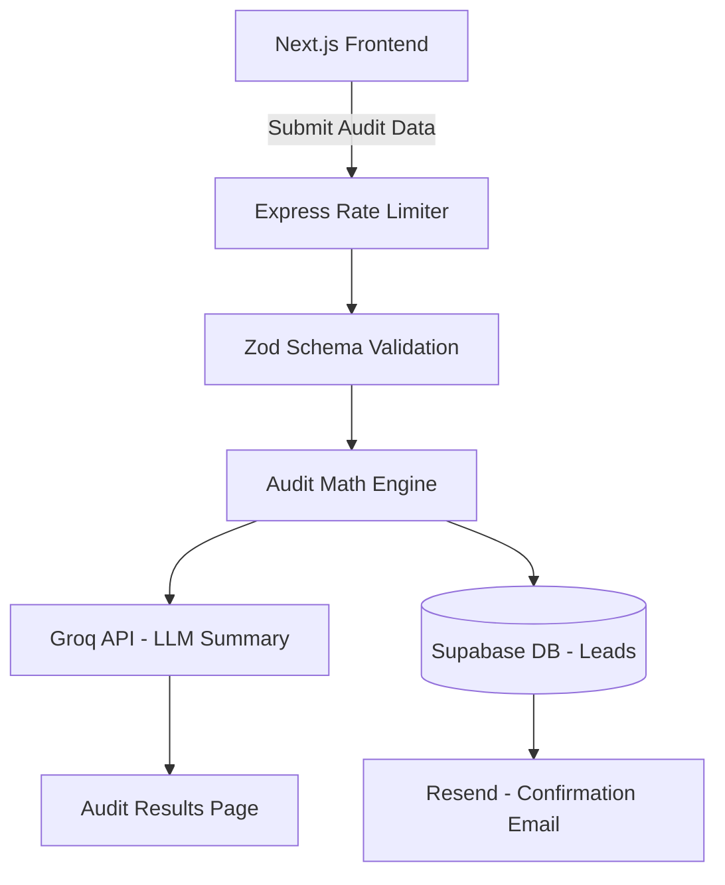

# System Architecture

## Data Flow Diagram

## Frontend Architecture (Implemented Day 3)

The frontend is built with Next.js (App Router) and follows a **State-Driven UI** pattern:

1. **Page Layer (`app/page.tsx`):** Owns the top-level `auditData` state. Conditionally renders `AuditForm` or `AuditResults` based on whether a response has been received — a clean single-responsibility swap with no router navigation required.
2. **Form Component (`AuditForm.tsx`):** Manages a dynamic list of subscription rows.
3. **Results Component (`AuditResults.tsx`):** Stateless display component. Receives the full audit payload as a prop and renders metrics, redundancy flags, the Credex offer banner, and the Groq AI executive summary. Strongly typed via explicit TypeScript interfaces — no `any`.
4. **Design System:** Glassmorphism aesthetic on a pure black (`#000000`) base using Tailwind CSS and `shadcn/ui` (Slate / New York style) to produce a premium SaaS feel.
5. **Motion Layer:** Framer Motion staggered entry animations orchestrate the transition between landing, form, and results states.

## Backend Architecture (Implemented Day 2)

We utilize a **Layered Domain Architecture** to strictly separate concerns:

1. **Route Layer (`routes/`):** Defines endpoints and attaches necessary middleware (Rate Limiting, Validation).
2. **Middleware Shield (`middlewares/` & `validations/`):** Zod intercepts and validates all incoming HTTP requests before they reach the controller. A Global Error Handler catches custom `AppError` instances to standardize failure states.
3. **Controller Layer (`controllers/`):** Extracts valid data from the request object and orchestrates calls to the Service layer. Returns the final JSON response. Implements a **Fire-and-Forget** pattern — lead capture (Supabase + Resend) is not awaited, so the API responds instantly without blocking on I/O.
4. **Service Layer (`services/`):** The isolated "Brain." Contains pure business logic, mathematical overlap detection, and 3rd-party integrations (Groq, Supabase, Resend). Has zero knowledge of the HTTP context.