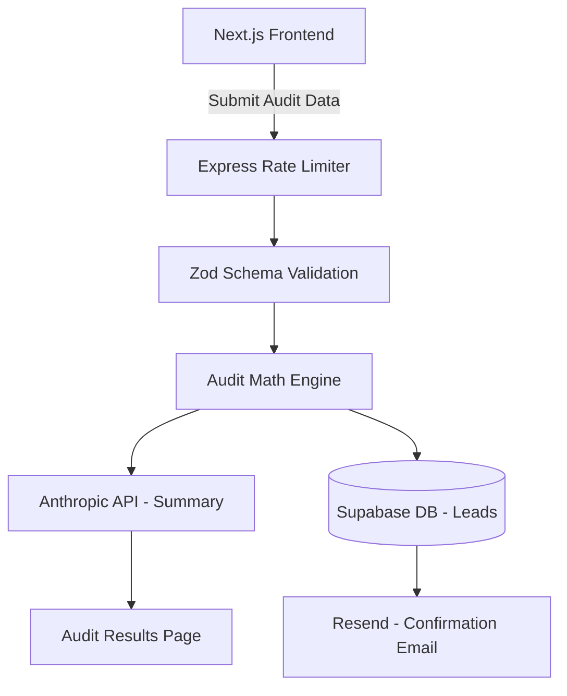

# System Architecture

## Data Flow Diagram

### Backend Architecture (Implemented Day 2)
We utilize a **Layered Domain Architecture** to strictly separate concerns:
1. **Route Layer (`routes/`):** Defines the endpoints and attaches necessary middleware (Rate Limiting, Validation).
2. **Middleware Shield (`middlewares/` & `validations/`):** Zod intercepts and validates all incoming HTTP requests before they reach the controller. A Global Error Handler catches custom `AppError` instances to standardize failure states.
3. **Controller Layer (`controllers/`):** Extracts valid data from the request object and passes it to the Service layer. Returns the final JSON response.
4. **Service Layer (`services/`):** The isolated "Brain." Contains pure business logic, mathematical processing, and soon, 3rd-party API integrations (Anthropic, Resend). It has zero knowledge of the HTTP context.