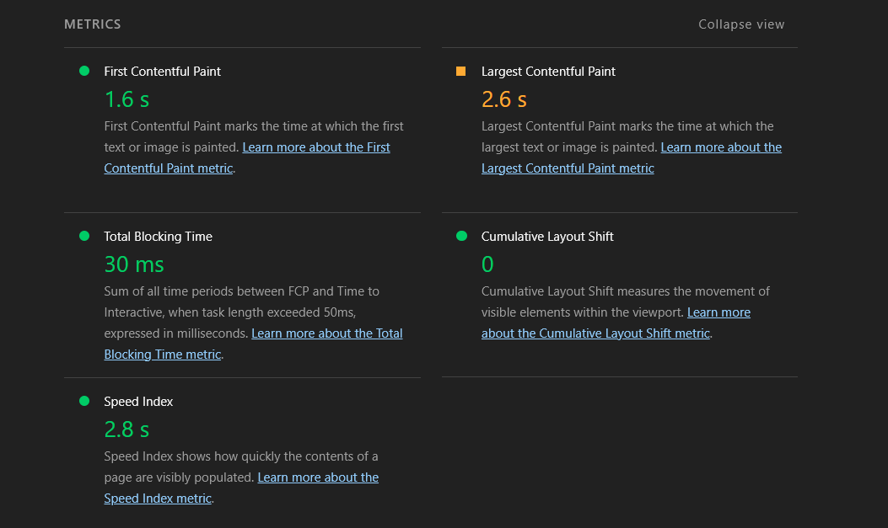

# Credex Audit: Stop Overpaying for AI

Credex Audit is a free, interactive diagnostic tool designed for startup founders and engineering managers to instantly identify wasteful spending on overlapping AI subscriptions. It analyzes a user's specific tech stack, flags redundant tools, recommends optimized tier downgrades, and surfaces exclusive enterprise consolidation discounts through Credex.

## 🌐 Live Demo & Deployment
- **Frontend (Vercel):** [https://credex-audit-seven.vercel.app/](https://credex-audit-seven.vercel.app/)

> ⚠️ **IMPORTANT NOTE FOR REVIEWERS:** > The backend API is hosted on Render's Free Tier, which spins down after 15 minutes of inactivity. **The very first time you click "Calculate" on the dashboard, it may take ~50 seconds for the backend to wake up and return the audit.** All subsequent requests will be instant. Thank you for your patience!

## 📸 Interface & Performance


*Landing page featuring a premium glassmorphism aesthetic.*

### Lighthouse Validation
The application was built with performance and accessibility as a priority, easily exceeding the assignment constraints:
- **Performance:** 96 (LCP: 2.6s, TBT: 30ms)
- **Accessibility:** 95
- **Best Practices:** 100
- **SEO:** 100



## 🚀 Quick Start (Local Development)

### Prerequisites
- Node.js (v20+)
- Supabase Account
- Resend API Key
- Groq API Key

### 1. Backend Setup
```bash
cd backend
npm install
```

### 1. frontend Setup
```bash
cd frontend
npm install
npm run dev
```


## 🧠 Engineering Decisions & Trade-offs

1. **Decoupled Architecture:** Chose a standalone Express server over Next.js API routes to implement custom middleware (rate-limiting, HPP) and ensure a clean SIGTERM shutdown process that serverless environments often abstract away.

2. **Runtime Validation (Zod):** Utilized JavaScript with Zod for schema validation on the backend. Provides type-safety at the API boundary without a TypeScript build step, keeping iteration speed high during this 7-day build.

3. **Defensive API:** Implemented `hpp` (HTTP Parameter Pollution protection) and a strict `10kb` JSON payload limit to protect the lead-generation endpoint from common exploitation patterns.

4. **AI Provider Pivot (Hugging Face → Groq):** Originally integrated Hugging Face Inference API for the executive summary. Cold-start latency on free-tier models regularly exceeded 20s, causing client-side timeouts. Pivoted to Groq (`llama-3.1-8b-instant`) which consistently responds in under 2s with no cold-start penalty.

5. **Fire-and-Forget Lead Capture:** The Express controller does not `await` the Supabase upsert or Resend email calls. The API responds to the client immediately with the audit result, while lead capture completes asynchronously in the background. This keeps P99 response times low and ensures a DB or email failure never degrades the user-facing experience.

6. **State-Driven Frontend:** Built the Next.js frontend around a single `auditData` state in `page.tsx`. When null, the form renders; when populated, the results dashboard renders. No client-side routing required — the swap is instant and the mental model stays simple.

7. **Strong Typing on the Frontend:** Replaced all `any` types in `AuditResults.tsx` with explicit TypeScript interfaces mirroring the backend response shape. Compile-time safety across the full data contract.
